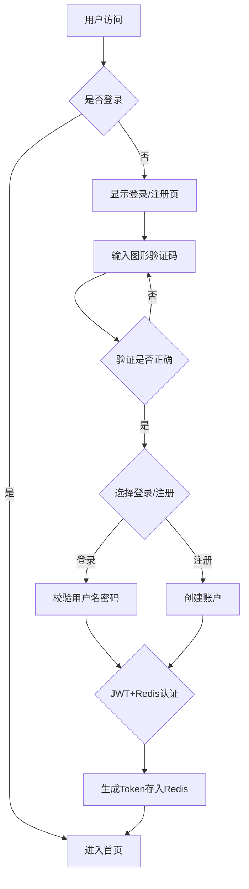
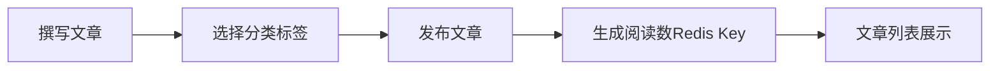
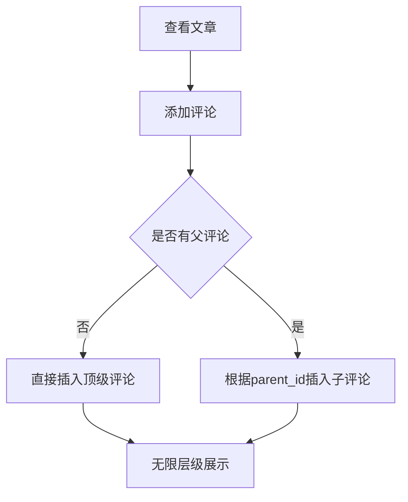

# 博客系统产品需求文档

## 1. 产品概述
- 一个功能完善的个人博客平台，支持用户注册登录、文章发布管理、互动评论、全文搜索和管理员系统管理
- 面向技术博客作者和读者，提供简洁高效的博客创作和阅读体验

## 2. 核心功能

### 2.1 用户角色
| 角色 | 注册方式 | 核心权限 |
|------|---------|---------|
| 普通用户 | 邮箱注册 | 浏览文章、发布文章、评论互动、个人设置 |
| 管理员 | 系统预设 | 系统管理、日志查看、用户管理 |

### 2.2 功能模块
1. **用户模块**: 注册、登录、图形验证码、个人资料管理（头像、密码、签名）
2. **文章模块**: 文章增删改查、分类标签管理、阅读量统计
3. **互动模块**: 点赞、收藏、无限层级评论回复
4. **搜索模块**: 全局搜索、个人搜索、搜索历史记录
5. **管理模块**: 系统日志、用户管理、系统设置

## 3. 核心流程

### 3.1 用户注册登录流程

### 3.2 文章发布流程

### 3.3 评论互动流程

## 4. 用户界面设计

### 4.1 设计风格
- **主色调**: 深墨绿 `#1a3a32` 搭配米白 `#f5f5f0`
- **辅助色**: 金色点缀 `#c9a959`、浅灰 `#e8e8e8`
- **按钮风格**: 圆角矩形，hover时有微妙阴影上浮
- **字体**: 标题使用 Noto Serif SC，正文使用 Noto Sans SC
- **布局风格**: 左侧边栏导航 + 右侧内容区，卡片式布局
- **图标**: 使用 Lucide Icons 简洁线条风格

### 4.2 页面设计概览
| 页面名称 | 模块名称 | UI元素 |
|---------|---------|-------|
| 首页 | Hero区域 | 大图背景、博客slogan、快捷搜索栏 |
| 首页 | 文章列表 | 卡片式文章预览、分类标签筛选 |
| 文章详情 | 文章主体 | 标题、作者信息、正文、标签 |
| 文章详情 | 互动栏 | 点赞、收藏、评论数 |
| 文章详情 | 评论区 | 无限层级评论树、回复按钮 |
| 个人中心 | 资料卡片 | 头像、昵称、签名、统计 |
| 个人中心 | 文章管理 | 文章列表、编辑删除 |
| 管理后台 | 侧边导航 | 系统管理、日志管理、用户管理 |
| 管理后台 | 日志列表 | 时间、操作类型、日志内容 |

### 4.3 响应式设计
- 桌面端优先设计，最小宽度 1200px
- 平板适配 (768px-1200px): 侧边栏可折叠
- 移动端适配 (<768px): 底部Tab导航、汉堡菜单

## 5. 性能需求
- 页面加载时间控制在 2 秒以内
- 文章查询等常见操作响应时间 ≤ 10ms
- Redis 缓存热门文章、用户会话、验证码
- 防止缓存穿透：设置空值缓存
- 防止缓存击穿：互斥锁或永久缓存
- 防止缓存雪崩：随机过期时间

## 6. 安全需求
- 密码使用 BCrypt 加密存储
- JWT Token 有效期 24 小时
- 图形验证码有效期 5 分钟
- 接口需身份认证的请求通过拦截器验证
