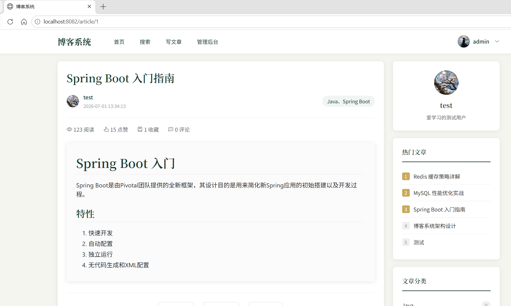
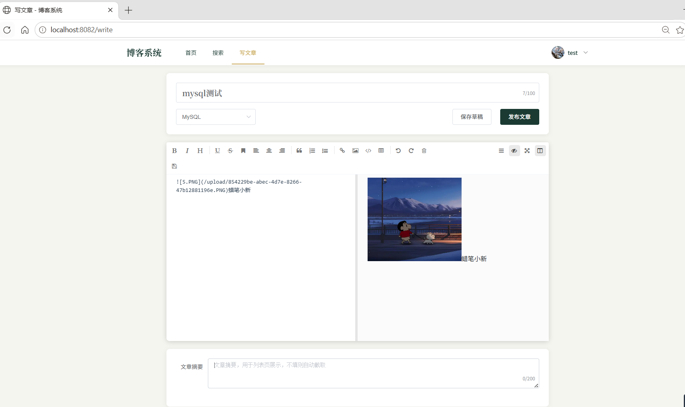
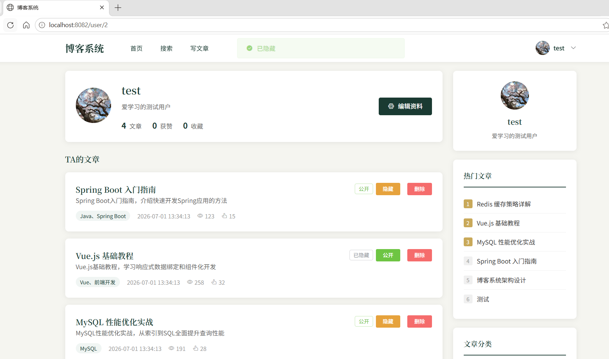
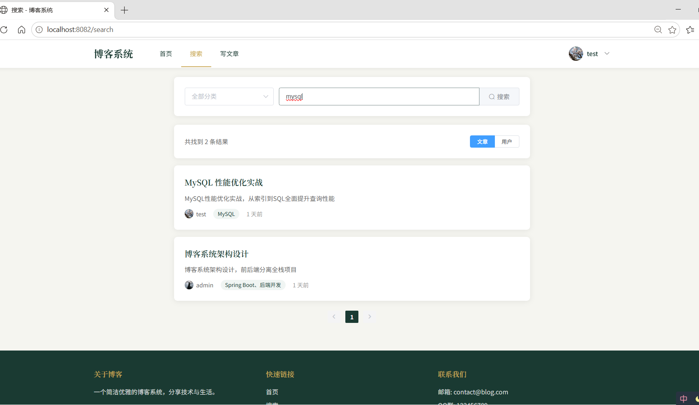
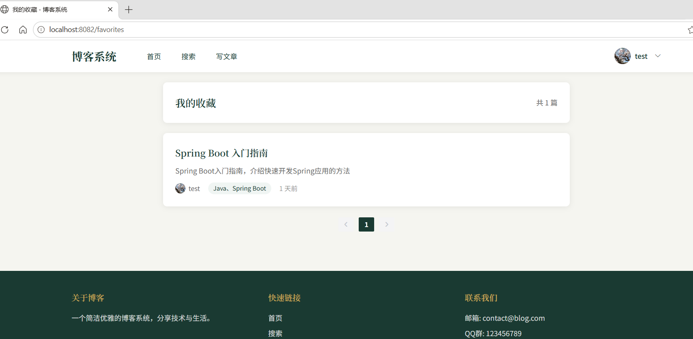
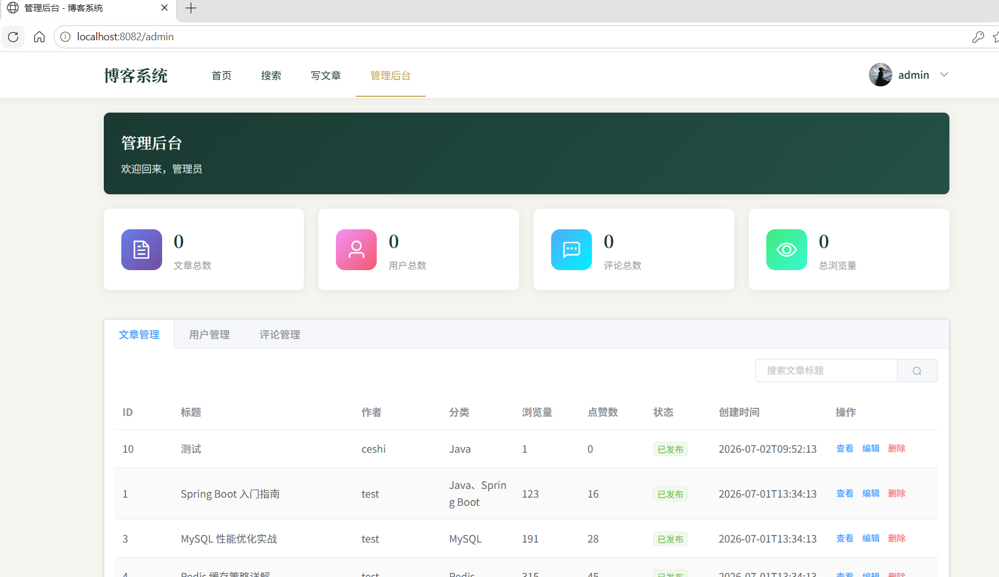

<div align="center">
  <h1>📝 博客系统 Blog System</h1>
  <p>一个前后端分离的全栈博客系统，支持用户注册登录、Markdown文章发布、互动评论、全文搜索、管理员后台等完整功能</p>

[](https://spring.io/projects/spring-boot)
[](https://vuejs.org/)
[](https://www.mysql.com/)
[](https://redis.io/)
[](https://openjdk.org/)
[](LICENSE)

</div>

---

## ✨ 项目介绍

本项目是一个功能完整、架构清晰的**前后端分离博客系统**，后端采用 Spring Boot 3 + MyBatis-Plus + MySQL + Redis 技术栈，前端采用 Vue 2 + ElementUI + Axios 技术栈，提供从用户注册、文章发布、互动评论到管理后台的完整博客功能。

代码结构规范、注释清晰，适合作为**毕业设计、个人作品集、学习全栈开发**的参考项目。

---

## 🖼️ 项目截图

> 📌 **以下位置需要插入项目运行截图，请你自行截图后替换。建议放在项目根目录下的 `docs/images/` 文件夹中。**
>
> **需要提供的截图清单（共 8 张）：**
>
> | 序号 | 截图名称 | 截图说明 | 建议文件名 |
> |------|---------|---------|-----------|
> | 1 | 首页截图 | 博客首页，展示文章列表、侧边栏分类、热门文章 | `home-page.png` |
> | 2 | 登录/注册页 | 登录注册界面，含验证码输入 | `login-page.png` |
> | 3 | 文章详情页 | 展示Markdown渲染后的文章内容、评论区 | `article-detail.png` |
> | 4 | 写文章页面 | Markdown编辑器界面（左右分栏预览） | `write-article.png` |
> | 5 | 个人设置页 | 修改头像、昵称、密码、个人简介 | `settings-page.png` |
> | 6 | 搜索结果页 | 搜索关键词后的文章列表 | `search-page.png` |
> | 7 | 我的收藏页 | 用户收藏的文章列表 | `favorites-page.png` |
> | 8 | 管理后台页 | 管理员数据统计面板 / 用户管理 | `admin-dashboard.png` |

<!-- 👇 请将下面的路径替换为你实际的图片路径 👇 -->

### 1. 首页 - 文章列表


### 2. 登录 / 注册


### 3. 文章详情 + 评论


### 4. Markdown 编辑器（写文章）


### 5. 个人设置


### 6. 搜索结果


### 7. 我的收藏


### 8. 管理后台


---

## 🛠️ 技术栈

### 🔧 后端技术栈

| 技术 | 版本 | 说明 |
|------|------|------|
| Spring Boot | 3.2.0 | 后端核心框架，自动配置快速开发 |
| MyBatis-Plus | 3.5.7 | ORM增强框架，简化CRUD操作 |
| MySQL | 8.0+ | 关系型数据库（⚠️ MySQL 5.7不支持Flyway社区版） |
| Redis | 6.0+ | 缓存中间件，存储Token/验证码/热门数据 |
| JWT (jjwt) | 0.12.5 | 无状态Token身份认证 |
| SpringDoc OpenAPI | 2.5.0 | 自动生成Swagger接口文档 |
| Flyway | 内置 | 数据库版本迁移管理 |
| Spring Validation | 内置 | 参数校验框架 |
| Kaptcha | 2.3.3 | 图形验证码生成 |
| Hutool | 5.8.29 | Java工具类库 |
| Lombok | 内置 | 简化Java实体类代码 |
| Commons-Lang3 | 内置 | 字符串工具类 |

### 🎨 前端技术栈

| 技术 | 版本 | 说明 |
|------|------|------|
| Vue | 2.7.16 | 前端渐进式框架 |
| Vue Router | 3.6.5 | SPA路由管理，支持History模式 |
| Vuex | 3.6.2 | 全局状态管理（用户信息、Token） |
| ElementUI | 2.15.14 | PC端UI组件库 |
| Axios | 1.6.2 | HTTP请求库，拦截器统一处理401 |
| mavon-editor | 2.10.4 | Markdown编辑器（支持实时预览） |
| Day.js | 1.11.10 | 轻量级时间处理库 |
| Sass | 1.69.5 | CSS预处理器 |

---

## 📦 功能模块

### 👤 用户模块
- ✅ 邮箱注册 / 邮箱登录（图形验证码防暴力破解）
- ✅ JWT + Redis 双重认证机制
- ✅ 找回密码（验证码方式）
- ✅ 修改头像、昵称、个人简介、密码
- ✅ 个人主页（展示用户发布的所有文章）
- ✅ 登录拦截器 + 路由守卫双权限控制
- ✅ 登出清除Token，自动跳转登录页

### ✍️ 文章模块
- ✅ Markdown编辑器写文章（分栏实时预览）
- ✅ 文章新增、编辑、发布、删除、草稿
- ✅ 文章分类 + 标签管理
- ✅ 阅读量统计（IP去重，Redis实现）
- ✅ 热门文章排行榜（按阅读量）
- ✅ 文章列表分页 + 按分类筛选
- ✅ 文章可见性控制（公开/仅自己可见）

### 💬 互动模块
- ✅ 文章点赞 / 取消点赞
- ✅ 文章收藏 / 取消收藏
- ✅ 无限层级评论回复（支持 @回复某人）
- ✅ 评论点赞
- ✅ 我的收藏列表

### 🔍 搜索模块
- ✅ 全站文章关键词搜索（标题 + 摘要 + 内容）
- ✅ 搜索历史记录
- ✅ 一键清空搜索历史

### 🛡️ 管理员后台
- ✅ 数据统计面板（用户数、文章数、评论数、总阅读量）
- ✅ 用户管理（启用/禁用账号、删除用户）
- ✅ 系统日志管理（操作日志、IP、耗时）
- ✅ 管理员角色权限控制（普通用户无法访问）

---

## 🏗️ 项目结构

```
BoKeXm/
├── blog-backend/                     # 后端项目 (Spring Boot)
│   ├── src/main/java/com/blog/
│   │   ├── BlogApplication.java      # 启动类
│   │   ├── common/                   # 公共模块
│   │   │   ├── Result.java           # 统一响应封装
│   │   │   ├── JwtUtil.java          # JWT工具类
│   │   │   ├── RedisUtil.java        # Redis工具类
│   │   │   └── PageResult.java       # 分页结果封装
│   │   ├── config/                   # 配置类
│   │   │   ├── MybatisPlusConfig.java # MyBatis-Plus配置
│   │   │   ├── RedisConfig.java      # Redis序列化配置
│   │   │   ├── CorsConfig.java       # 跨域配置
│   │   │   ├── SwaggerConfig.java    # Swagger配置
│   │   │   └── CaptchaConfig.java    # 验证码配置
│   │   ├── controller/               # 控制层 (7个Controller)
│   │   │   ├── UserController        # 用户相关接口
│   │   │   ├── ArticleController     # 文章相关接口
│   │   │   ├── CommentController     # 评论相关接口
│   │   │   ├── InteractionController # 点赞收藏接口
│   │   │   ├── SearchController      # 搜索接口
│   │   │   └── AdminController       # 管理员接口
│   │   ├── dto/                      # 数据传输对象 (请求参数)
│   │   ├── entity/                   # 数据库实体类 (9张表)
│   │   ├── vo/                       # 视图对象 (返回数据)
│   │   ├── service/                  # 业务层
│   │   │   └── impl/                 # 业务实现类
│   │   ├── mapper/                   # 数据访问层 (MyBatis-Plus)
│   │   ├── interceptor/              # 登录拦截器
│   │   └── exception/                # 全局异常处理
│   ├── src/main/resources/
│   │   ├── application.yml           # 主配置文件
│   │   └── db/migration/             # Flyway迁移脚本
│   │       ├── V1__init.sql          # 初始化（9张表+测试数据）
│   │       └── V2__add_nickname_and_bio.sql
│   ├── upload/                       # 头像/图片上传目录
│   └── pom.xml
│
├── blog-frontend/                    # 前端项目 (Vue 2)
│   ├── src/
│   │   ├── api/                      # API接口封装 (按模块)
│   │   │   ├── request.js            # Axios实例 + 拦截器
│   │   │   ├── user.js               # 用户接口
│   │   │   ├── article.js            # 文章接口
│   │   │   ├── comment.js            # 评论接口
│   │   │   └── search.js             # 搜索接口
│   │   ├── assets/css/global.css     # 全局样式
│   │   ├── components/               # 公共组件
│   │   │   ├── Header.vue            # 顶部导航栏
│   │   │   ├── Sidebar.vue           # 侧边栏(分类/热门)
│   │   │   └── Footer.vue            # 底部
│   │   ├── views/                    # 页面组件 (10个页面)
│   │   │   ├── Home.vue              # 首页
│   │   │   ├── Login.vue             # 登录/注册
│   │   │   ├── ForgotPassword.vue    # 找回密码
│   │   │   ├── ArticleDetail.vue     # 文章详情
│   │   │   ├── WriteArticle.vue      # 写文章 / 编辑
│   │   │   ├── Search.vue            # 搜索结果
│   │   │   ├── UserProfile.vue       # 用户主页
│   │   │   ├── Settings.vue          # 个人设置
│   │   │   ├── Favorites.vue         # 我的收藏
│   │   │   └── Admin.vue             # 管理后台
│   │   ├── router/index.js           # 路由配置 + 路由守卫
│   │   ├── store/index.js            # Vuex状态管理
│   │   ├── utils/                    # 工具函数
│   │   │   ├── auth.js               # Token存取
│   │   │   └── format.js             # 时间格式化
│   │   ├── App.vue
│   │   └── main.js
│   ├── public/index.html
│   ├── vue.config.js                 # 代理配置 (8082→8081)
│   ├── babel.config.js
│   └── package.json
│
├── docs/images/                      # 📌 文档截图（你需要自己创建并放图）
├── PRD.md                            # 产品需求文档
├── TECH_ARCHITECTURE.md              # 技术架构文档
├── stop-all.ps1                      # 一键关闭脚本 (PowerShell)
├── stop-all.cmd                      # 一键关闭脚本 (CMD双击版)
└── README.md
```

---

## 🚀 快速开始

### 环境准备（必装）

| 环境 | 版本要求 | 下载地址 |
|------|---------|---------|
| JDK | **21** (必须) | https://openjdk.org/projects/jdk/21/ |
| Maven | 3.6+ | https://maven.apache.org/download.cgi |
| Node.js | 14+（推荐 16/18 LTS） | https://nodejs.org/ |
| MySQL | **8.0+** (⚠️ 5.7 不行) | https://dev.mysql.com/downloads/mysql/ |
| Redis | 6.0+（默认端口6379，无密码） | Windows用Memurai或Redis-x64 |

> 💡 Windows 可以使用 **PHPStudy** 一键启动 MySQL + Redis，非常方便。

---

### 步骤一：配置数据库连接

项目已提供两种配置方式，**任选其一**即可：

#### 方式 A：直接修改默认配置（推荐新手）
编辑 `blog-backend/src/main/resources/application.yml`，修改以下两项：
```yaml
spring:
  datasource:
    username: ${DB_USERNAME:root}         # 冒号后是默认值，和你 MySQL 不一致就改
    password: ${DB_PASSWORD:123456}       # 改为你自己的 MySQL 密码
```

#### 方式 B：使用示例模板（推荐，更规范）
```bash
# 1. 复制示例文件
cd blog-backend/src/main/resources
cp application.example.yml application.yml

# 2. 编辑刚复制的 application.yml，填入你自己的 MySQL 密码、JWT 密钥等
```
> 💡 方式 B 的好处：`application.yml` 已加入 `.gitignore`，以后改密码不会被误提交。

---

### 步骤二：启动 MySQL 并执行初始化脚本

1. 确保 MySQL 服务已启动（默认端口 `3306`）
2. 数据库会自动创建（JDBC URL 带了 `createDatabaseIfNotExist=true`）
3. **⚠️ 必须手动执行初始化 SQL**（因为默认 `flyway.enabled=false`）：
   - 打开 Navicat / MySQL Workbench
   - 选中 `blog_system` 数据库
   - 执行 `blog-backend/src/main/resources/db/migration/V1__init.sql`
   - 再执行 `V2__add_nickname_and_bio.sql`
   - 执行成功后会自动创建 9 张表 + 管理员/测试账号 + 示例文章

> 后续需要自动迁移可把 `application.yml` 中 `flyway.enabled` 改为 `true`。

---

### 步骤二：启动 Redis

确保 Redis 服务运行在 **默认端口 6379**，**无密码**。

Windows（PHPStudy）直接点启动即可；Linux/Mac：
```bash
redis-server
```

---

### 步骤三：启动后端服务

```powershell
# 进入后端目录
cd blog-backend

# 编译 + 启动（第一次会下载依赖，耐心等待）
mvn clean spring-boot:run
```

> ⚠️ 第一次启动前建议手动执行 SQL 脚本，因为 `application.yml` 中 `flyway.enabled=false`：
> 把 `blog-backend/src/main/resources/db/migration/V1__init.sql` 直接拿到 Navicat / MySQL Workbench 执行一遍即可。
>
> 需要开启 Flyway 自动迁移的话，把 `flyway.enabled` 改为 `true`。

**启动成功后访问：**
| 项目 | 地址 |
|------|------|
| 后端接口根路径 | http://localhost:8081/api |
| Swagger 接口文档 | http://localhost:8081/api/swagger-ui/index.html |

---

### 步骤四：启动前端服务

```powershell
# 进入前端目录
cd blog-frontend

# 安装依赖（第一次需要）
npm install

# 启动开发服务器
npm run serve
```

**启动成功后会自动打开浏览器：**
| 项目 | 地址 |
|------|------|
| 前端首页 | http://localhost:8082 |

前端 8082 通过 `vue.config.js` 代理配置，自动把 `/api` 请求转发到后端 8081，无需额外配置跨域。

---

### 一键关闭服务

项目提供了一键关闭脚本，不用手动杀进程：

- **Windows CMD**：双击根目录的 `stop-all.cmd`
- **PowerShell**：右键 `stop-all.ps1` → 使用 PowerShell 运行

会自动关闭占用 `8081`（后端）和 `8082`（前端）端口的进程。

---

## 🔑 默认账户

系统初始化时已内置两个账号：

| 角色 | 邮箱 | 用户名 | 密码 |
|------|------|--------|------|
| 👑 管理员 | admin@blog.com | admin | 123456 |
| 👤 普通用户 | test@blog.com | test | 123456 |

> 💡 登录必须使用**邮箱**，用户名登录已禁用。

---

## 📡 API 接口概览

完整接口文档启动后端后请访问 Swagger UI：
👉 http://localhost:8081/api/swagger-ui/index.html

### 用户模块 `/api/user`
| 方法 | 路径 | 说明 | 认证 |
|------|------|------|------|
| GET | `/user/captcha` | 获取图形验证码（Base64） | ❌ |
| POST | `/user/register` | 注册（邮箱+密码+验证码） | ❌ |
| POST | `/user/login` | 登录（邮箱+密码+验证码） | ❌ |
| POST | `/user/logout` | 登出（清除Redis Token） | ✅ |
| GET | `/user/info` | 获取当前登录用户信息 | ✅ |
| PUT | `/user/info` | 修改用户信息（昵称/简介/头像） | ✅ |
| PUT | `/user/password` | 修改密码（旧密码+新密码） | ✅ |
| POST | `/user/forgot/send-code` | 发送找回密码验证码 | ❌ |
| POST | `/user/forgot/reset` | 重置密码 | ❌ |
| GET | `/user/{id}` | 查看指定用户主页信息 | ❌ |

### 文章模块 `/api/article`
| 方法 | 路径 | 说明 | 认证 |
|------|------|------|------|
| GET | `/article/list` | 首页文章列表（分页+分类筛选） | ❌ |
| GET | `/article/{id}` | 文章详情（自动+1阅读量） | ❌ |
| POST | `/article` | 发布新文章 | ✅ |
| PUT | `/article/{id}` | 编辑文章（仅作者） | ✅ |
| DELETE | `/article/{id}` | 删除文章（仅作者） | ✅ |
| GET | `/article/hot` | 热门文章 Top10 | ❌ |
| GET | `/article/user/{userId}` | 某用户的文章列表 | ❌ |
| GET | `/article/category/list` | 全部分类列表 | ❌ |

### 互动模块 `/api`
| 方法 | 路径 | 说明 | 认证 |
|------|------|------|------|
| POST | `/article/{id}/like` | 点赞 / 取消点赞（切换） | ✅ |
| POST | `/article/{id}/favorite` | 收藏 / 取消收藏（切换） | ✅ |
| GET | `/article/favorite/list` | 我的收藏列表 | ✅ |
| POST | `/comment` | 发表评论 / 回复 | ✅ |
| DELETE | `/comment/{id}` | 删除评论（仅作者） | ✅ |
| GET | `/comment/list` | 某篇文章的评论列表（树形结构） | ❌ |

### 搜索模块 `/api/search`
| 方法 | 路径 | 说明 | 认证 |
|------|------|------|------|
| GET | `/search` | 关键词搜索文章 | ❌ |
| GET | `/search/history` | 我的搜索历史 | ✅ |
| DELETE | `/search/history` | 清空搜索历史 | ✅ |

### 管理员模块 `/api/admin`（角色=1才能访问）
| 方法 | 路径 | 说明 |
|------|------|------|
| GET | `/admin/statistics` | 数据统计（总数、今日新增、趋势） |
| GET | `/admin/user/list` | 用户列表（分页） |
| PUT | `/admin/user/{id}/status` | 启用 / 禁用用户 |
| DELETE | `/admin/user/{id}` | 删除用户 |
| GET | `/admin/log/list` | 系统操作日志列表 |

---

## 🗄️ 数据库设计

共 **9 张数据表**：

| 表名 | 说明 | 核心字段 |
|------|------|---------|
| `user` | 用户表 | id, username, nickname, email, password, avatar, bio, role(0普通/1管理员), status |
| `category` | 分类表 | id, name, sort |
| `article` | 文章表 | id, user_id, title, content, summary, category_ids, tags, view_count, like_count, favorite_count, comment_count, status(1发布/0草稿) |
| `comment` | 评论表 | id, article_id, user_id, parent_id, reply_user_id, content, like_count |
| `article_like` | 文章点赞表 | article_id + user_id 联合唯一 |
| `favorite` | 收藏表 | article_id + user_id 联合唯一 |
| `search_history` | 搜索历史表 | user_id, keyword |
| `sys_log` | 系统日志表 | user_id, operation, method, params, ip, status, time(耗时ms) |
| `flyway_schema_history` | Flyway版本表 | 自动管理 |

数据库 ER 图建议使用 Navicat / DBeaver 导出后放在 `docs/images/er-diagram.png`。

---

## ⚡ Redis 缓存策略

| Key 模式 | 过期时间 | 用途 |
|---------|---------|------|
| `blog:user:token:{userId}` | 24h | 存储登录态 Token，登出主动删除 |
| `blog:user:captcha:{uuid}` | 2min | 登录/注册图形验证码 |
| `blog:user:info:{userId}` | 30min | 用户信息缓存 |
| `blog:article:view:{ip}:{id}` | 24h | 阅读量去重（同一IP24h内只+1） |
| `blog:article:hot` | 10min | 热门文章 Top10 缓存 |
| `blog:search:history:{userId}` | 7d | 搜索历史 |

**缓存防护：**
- ✅ **防穿透**：空结果缓存 60s
- ✅ **防击穿**：热门文章互斥锁重建缓存
- ✅ **防雪崩**：过期时间加 ±300s 随机偏移

---

## 🎯 核心设计亮点

1. **深墨绿 + 米白配色**：简约优雅的博客风格，护眼不疲劳
2. **JWT + Redis 双认证**：JWT 无状态 + Redis 可控过期/登出，兼顾性能与安全
3. **路由守卫 + 拦截器双保险**：前端路由拦截 `requireAuth`，后端 `LoginInterceptor` 校验 Token
4. **401 静默跳转**：Axios 拦截器检测 401 自动跳转 `/login`，不弹多余提示
5. **MyBatis-Plus 代码精简**：通用 CRUD 自动实现，配合 QueryWrapper 极速开发
6. **Flyway 版本迁移**：数据库结构变更可追踪，团队协作无冲突
7. **全局异常处理**：`@RestControllerAdvice` 统一封装错误响应，前端只需处理业务
8. **DTO/VO/Entity 分层**：请求参数、数据库实体、返回数据严格解耦
9. **Markdown 分栏预览**：mavon-editor 编辑器，写作所见即所得
10. **评论无限层级**：递归树形结构返回，前端嵌套渲染回复楼中楼

---

## 📋 部署到服务器参考

1. **后端打包**：
   ```bash
   cd blog-backend
   mvn clean package -DskipTests
   # 得到 target/blog-backend-1.0.0.jar
   ```
   上传后运行：
   ```bash
   java -jar blog-backend-1.0.0.jar --spring.datasource.password=你的密码
   ```

2. **前端打包**：
   ```bash
   cd blog-frontend
   npm run build
   # 得到 dist/ 目录
   ```
   把 `dist/` 放到 Nginx，配置反向代理：
   ```nginx
   server {
       listen 80;
       server_name your-domain.com;
       root /var/www/blog/dist;
       index index.html;

       location / {
           try_files $uri $uri/ /index.html;
       }
       location /api/ {
           proxy_pass http://127.0.0.1:8081/api/;
       }
       location /upload/ {
           proxy_pass http://127.0.0.1:8081/api/upload/;
       }
   }
   ```

---

## 🤝 贡献指南

欢迎提交 Issue 和 Pull Request！

1. Fork 本仓库
2. 创建 Feature 分支：`git checkout -b feature/xxx`
3. 提交改动：`git commit -m 'Add xxx'`
4. 推送分支：`git push origin feature/xxx`
5. 新建 Pull Request

---

## 📄 许可证

MIT License BoKeXm

---

## 🙏 致谢

如果你觉得这个项目对你有帮助，欢迎点个 ⭐ Star，你的支持是我持续创作的动力！
