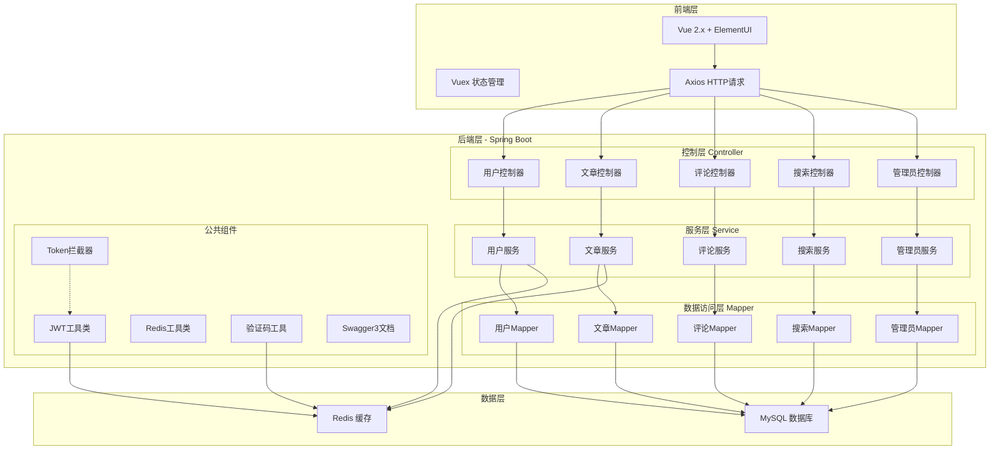
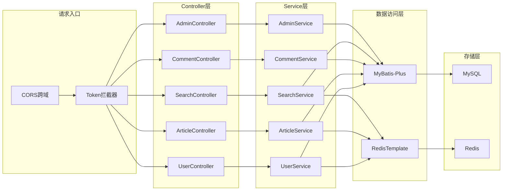
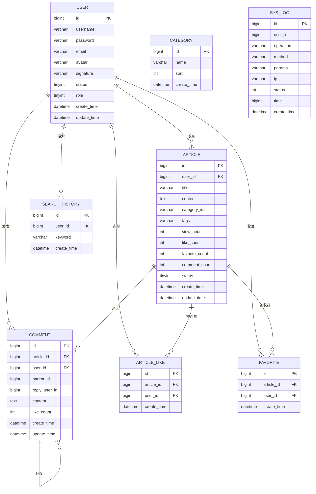

# 博客系统技术架构文档

## 1. 架构设计



## 2. 技术栈说明

### 2.1 后端技术栈
| 技术 | 版本 | 说明 |
|------|------|------|
| Spring Boot | 2.7.18 | 核心框架 |
| MyBatis-Plus | 3.5.3.1 | ORM持久层框架 |
| MySQL | 8.0+ | 关系型数据库 |
| Redis | 6.0+ | 缓存中间件 |
| JWT | 0.11.5 | Token生成与验证 |
| Swagger3 | 2.2.0 | 接口文档 |
| Lombok | 1.18.30 | 简化Java代码 |
| BCrypt | - | 密码加密 |

### 2.2 前端技术栈
| 技术 | 版本 | 说明 |
|------|------|------|
| Vue | 2.7.16 | 前端框架 |
| ElementUI | 2.15.14 | UI组件库 |
| Axios | 1.6.2 | HTTP请求库 |
| Vue Router | 3.6.5 | 路由管理 |
| Vuex | 3.6.2 | 状态管理 |

### 2.3 数据库设计
- 字符集：utf8mb4
- 存储引擎：InnoDB
- 分类ID存储：category_id 字段以逗号分隔存储多个分类ID

## 3. 路由定义

### 3.1 前端路由
| 路由路径 | 页面名称 | 说明 |
|---------|---------|------|
| / | 首页 | 文章列表、搜索入口 |
| /login | 登录页 | 用户登录、注册切换 |
| /article/:id | 文章详情 | 文章内容、评论 |
| /user/:id | 用户主页 | 用户资料、用户文章 |
| /settings | 个人设置 | 修改头像、密码、签名 |
| /write | 写文章 | 新增/编辑文章 |
| /search | 搜索页 | 搜索结果、搜索历史 |
| /admin | 管理后台 | 系统管理 |

### 3.2 后端API路由
| 路由前缀 | 模块 | 说明 |
|---------|------|------|
| /api/user | 用户模块 | 注册、登录、个人信息 |
| /api/article | 文章模块 | 文章CRUD、分类标签 |
| /api/comment | 评论模块 | 评论、回复、点赞、收藏 |
| /api/search | 搜索模块 | 全文搜索、搜索历史 |
| /api/admin | 管理模块 | 系统日志、用户管理 |

## 4. API接口定义

### 4.1 统一响应格式
```java
@Data
public class Result<T> {
    private Integer code;
    private String message;
    private T data;
}
```

### 4.2 用户模块接口
| 方法 | 路径 | 说明 | 参数 |
|------|------|------|------|
| GET | /api/user/captcha | 获取验证码 | - |
| POST | /api/user/register | 用户注册 | username, password, email, captcha |
| POST | /api/user/login | 用户登录 | username, password, captcha |
| GET | /api/user/info | 获取用户信息 | token |
| PUT | /api/user/info | 更新用户信息 | avatar, signature |
| PUT | /api/user/password | 修改密码 | oldPassword, newPassword |

### 4.3 文章模块接口
| 方法 | 路径 | 说明 | 参数 |
|------|------|------|------|
| GET | /api/article/list | 文章列表 | page, size, categoryId |
| GET | /api/article/:id | 文章详情 | id |
| POST | /api/article | 发布文章 | title, content, categoryIds, tags |
| PUT | /api/article/:id | 编辑文章 | id, title, content, categoryIds, tags |
| DELETE | /api/article/:id | 删除文章 | id |
| GET | /api/article/hot | 热门文章 | - |
| GET | /api/category/list | 分类列表 | - |

### 4.4 互动模块接口
| 方法 | 路径 | 说明 | 参数 |
|------|------|------|------|
| POST | /api/comment | 发表评论 | articleId, content, parentId |
| GET | /api/comment/list | 评论列表 | articleId, page, size |
| POST | /api/article/:id/like | 点赞文章 | id |
| POST | /api/article/:id/favorite | 收藏文章 | id |
| GET | /api/article/favorite/list | 我的收藏 | page, size |

### 4.5 搜索模块接口
| 方法 | 路径 | 说明 | 参数 |
|------|------|------|------|
| GET | /api/search | 搜索文章 | keyword, page, size, type |
| GET | /api/search/history | 搜索历史 | - |
| DELETE | /api/search/history | 清空历史 | - |

### 4.6 管理模块接口
| 方法 | 路径 | 说明 | 参数 |
|------|------|------|------|
| GET | /api/admin/log/list | 系统日志列表 | page, size |
| GET | /api/admin/user/list | 用户列表 | page, size |
| PUT | /api/admin/user/:id/status | 启用/禁用用户 | id, status |

## 5. 服务架构图



## 6. 数据模型

### 6.1 ER图


### 6.2 DDL语句

```sql
SET NAMES utf8mb4;
SET FOREIGN_KEY_CHECKS = 0;

CREATE DATABASE IF NOT EXISTS blog_system DEFAULT CHARACTER SET utf8mb4 COLLATE utf8mb4_general_ci;

USE blog_system;

DROP TABLE IF EXISTS `user`;
CREATE TABLE `user` (
  `id` bigint NOT NULL AUTO_INCREMENT COMMENT '用户ID',
  `username` varchar(50) NOT NULL COMMENT '用户名',
  `password` varchar(100) NOT NULL COMMENT '密码',
  `email` varchar(100) DEFAULT NULL COMMENT '邮箱',
  `avatar` varchar(255) DEFAULT NULL COMMENT '头像',
  `signature` varchar(255) DEFAULT NULL COMMENT '个人签名',
  `status` tinyint NOT NULL DEFAULT '1' COMMENT '状态 1正常 0禁用',
  `role` tinyint NOT NULL DEFAULT '0' COMMENT '角色 0普通用户 1管理员',
  `create_time` datetime DEFAULT CURRENT_TIMESTAMP COMMENT '创建时间',
  `update_time` datetime DEFAULT CURRENT_TIMESTAMP ON UPDATE CURRENT_TIMESTAMP COMMENT '更新时间',
  PRIMARY KEY (`id`),
  UNIQUE KEY `uk_username` (`username`),
  UNIQUE KEY `uk_email` (`email`)
) ENGINE=InnoDB DEFAULT CHARSET=utf8mb4 COMMENT='用户表';

DROP TABLE IF EXISTS `article`;
CREATE TABLE `article` (
  `id` bigint NOT NULL AUTO_INCREMENT COMMENT '文章ID',
  `user_id` bigint NOT NULL COMMENT '作者ID',
  `title` varchar(200) NOT NULL COMMENT '文章标题',
  `content` longtext NOT NULL COMMENT '文章内容',
  `category_ids` varchar(255) DEFAULT NULL COMMENT '分类ID，逗号分隔',
  `tags` varchar(500) DEFAULT NULL COMMENT '标签，逗号分隔',
  `view_count` int NOT NULL DEFAULT '0' COMMENT '阅读数',
  `like_count` int NOT NULL DEFAULT '0' COMMENT '点赞数',
  `favorite_count` int NOT NULL DEFAULT '0' COMMENT '收藏数',
  `comment_count` int NOT NULL DEFAULT '0' COMMENT '评论数',
  `status` tinyint NOT NULL DEFAULT '1' COMMENT '状态 1已发布 0草稿',
  `create_time` datetime DEFAULT CURRENT_TIMESTAMP COMMENT '创建时间',
  `update_time` datetime DEFAULT CURRENT_TIMESTAMP ON UPDATE CURRENT_TIMESTAMP COMMENT '更新时间',
  PRIMARY KEY (`id`),
  KEY `idx_user_id` (`user_id`),
  KEY `idx_create_time` (`create_time`),
  KEY `idx_view_count` (`view_count`)
) ENGINE=InnoDB DEFAULT CHARSET=utf8mb4 COMMENT='文章表';

DROP TABLE IF EXISTS `category`;
CREATE TABLE `category` (
  `id` bigint NOT NULL AUTO_INCREMENT COMMENT '分类ID',
  `name` varchar(50) NOT NULL COMMENT '分类名称',
  `sort` int NOT NULL DEFAULT '0' COMMENT '排序',
  `create_time` datetime DEFAULT CURRENT_TIMESTAMP COMMENT '创建时间',
  PRIMARY KEY (`id`),
  UNIQUE KEY `uk_name` (`name`)
) ENGINE=InnoDB DEFAULT CHARSET=utf8mb4 COMMENT='分类表';

DROP TABLE IF EXISTS `comment`;
CREATE TABLE `comment` (
  `id` bigint NOT NULL AUTO_INCREMENT COMMENT '评论ID',
  `article_id` bigint NOT NULL COMMENT '文章ID',
  `user_id` bigint NOT NULL COMMENT '用户ID',
  `parent_id` bigint DEFAULT '0' COMMENT '父评论ID，0表示顶级评论',
  `reply_user_id` bigint DEFAULT NULL COMMENT '被回复用户ID',
  `content` text NOT NULL COMMENT '评论内容',
  `like_count` int NOT NULL DEFAULT '0' COMMENT '点赞数',
  `create_time` datetime DEFAULT CURRENT_TIMESTAMP COMMENT '创建时间',
  `update_time` datetime DEFAULT CURRENT_TIMESTAMP ON UPDATE CURRENT_TIMESTAMP COMMENT '更新时间',
  PRIMARY KEY (`id`),
  KEY `idx_article_id` (`article_id`),
  KEY `idx_parent_id` (`parent_id`),
  KEY `idx_user_id` (`user_id`)
) ENGINE=InnoDB DEFAULT CHARSET=utf8mb4 COMMENT='评论表';

DROP TABLE IF EXISTS `article_like`;
CREATE TABLE `article_like` (
  `id` bigint NOT NULL AUTO_INCREMENT COMMENT 'ID',
  `article_id` bigint NOT NULL COMMENT '文章ID',
  `user_id` bigint NOT NULL COMMENT '用户ID',
  `create_time` datetime DEFAULT CURRENT_TIMESTAMP COMMENT '创建时间',
  PRIMARY KEY (`id`),
  UNIQUE KEY `uk_article_user` (`article_id`,`user_id`),
  KEY `idx_user_id` (`user_id`)
) ENGINE=InnoDB DEFAULT CHARSET=utf8mb4 COMMENT='文章点赞表';

DROP TABLE IF EXISTS `favorite`;
CREATE TABLE `favorite` (
  `id` bigint NOT NULL AUTO_INCREMENT COMMENT 'ID',
  `article_id` bigint NOT NULL COMMENT '文章ID',
  `user_id` bigint NOT NULL COMMENT '用户ID',
  `create_time` datetime DEFAULT CURRENT_TIMESTAMP COMMENT '创建时间',
  PRIMARY KEY (`id`),
  UNIQUE KEY `uk_article_user` (`article_id`,`user_id`),
  KEY `idx_user_id` (`user_id`)
) ENGINE=InnoDB DEFAULT CHARSET=utf8mb4 COMMENT='收藏表';

DROP TABLE IF EXISTS `search_history`;
CREATE TABLE `search_history` (
  `id` bigint NOT NULL AUTO_INCREMENT COMMENT 'ID',
  `user_id` bigint NOT NULL COMMENT '用户ID',
  `keyword` varchar(100) NOT NULL COMMENT '搜索关键词',
  `create_time` datetime DEFAULT CURRENT_TIMESTAMP COMMENT '创建时间',
  PRIMARY KEY (`id`),
  KEY `idx_user_id` (`user_id`),
  KEY `idx_keyword` (`keyword`)
) ENGINE=InnoDB DEFAULT CHARSET=utf8mb4 COMMENT='搜索历史表';

DROP TABLE IF EXISTS `sys_log`;
CREATE TABLE `sys_log` (
  `id` bigint NOT NULL AUTO_INCREMENT COMMENT 'ID',
  `user_id` bigint DEFAULT NULL COMMENT '用户ID',
  `operation` varchar(50) DEFAULT NULL COMMENT '操作类型',
  `method` varchar(200) DEFAULT NULL COMMENT '请求方法',
  `params` text COMMENT '请求参数',
  `ip` varchar(50) DEFAULT NULL COMMENT 'IP地址',
  `status` tinyint NOT NULL DEFAULT '1' COMMENT '状态 1成功 0失败',
  `time` bigint DEFAULT '0' COMMENT '耗时ms',
  `create_time` datetime DEFAULT CURRENT_TIMESTAMP COMMENT '创建时间',
  PRIMARY KEY (`id`),
  KEY `idx_user_id` (`user_id`),
  KEY `idx_create_time` (`create_time`)
) ENGINE=InnoDB DEFAULT CHARSET=utf8mb4 COMMENT='系统日志表';

INSERT INTO `user` (`username`, `password`, `email`, `role`) VALUES 
('admin', '$2a$10$N.zmdr9k7uOCQb376NoUnuTJ8iAt6Z5EHsM8lE9lBOsl7iAt6Z5E', 'admin@blog.com', 1);

INSERT INTO `category` (`name`, `sort`) VALUES 
('Java', 1),
('Spring Boot', 2),
('Vue', 3),
('数据库', 4),
('前端', 5),
('后端', 6);

SET FOREIGN_KEY_CHECKS = 1;
```

## 7. Redis缓存策略

### 7.1 缓存Key设计
| Key模式 | 过期时间 | 说明 |
|---------|---------|------|
| token:{token} | 24h | 用户登录Token |
| user:info:{userId} | 30m | 用户信息缓存 |
| article:view:{ip}:{articleId} | 24h | 阅读量去重 |
| article:info:{articleId} | 30m | 文章详情缓存 |
| article:hot | 10m | 热门文章列表 |
| article:list:{page}:{size} | 5m | 文章列表缓存 |
| captcha:{uuid} | 5m | 图形验证码 |
| search:history:{userId} | 7d | 搜索历史缓存 |

### 7.2 缓存防穿透/击穿/雪崩
- **防穿透**：空值缓存，过期时间60秒
- **防击穿**：热门文章永不过期 + 互斥锁
- **防雪崩**：过期时间加随机值（±300秒）
